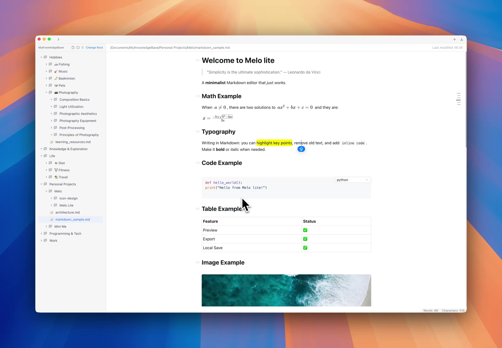

# Melo Lite

Melo Lite: Where Your Ideas Find Their Tempo — a Markdown‑powered personal knowledge hub that organizes your thoughts in the most natural flow.

## Key Features

### Your Folders, Your Workspace
- Native file system integration
- Works with your existing folder structure
- Zero learning curve - use it like your file explorer

### Write As You Think
- Intuitive Markdown support
- Real-time preview
- Distraction-free writing environment
- Rich text experience without complexity

### Local First, Always
- 100% offline capable
- Standard file formats
- Your data stays on your device
- No cloud lock-in, no proprietary formats

## Our Philosophy

A second brain emerges from the seamless flow between collecting and creating. We unite these activities in one workspace, with no barriers between your materials and creations. Just you and your knowledge, growing naturally.

> "Collect, Organize, Distill, Express - all in one space."

## Get Started

Visit [Melo Lite Website](https://lite.melolib.com) to explore features in detail —  or skip the wait and download instantly via [GitHub Releases](https://github.com/melo-libs/melo-lite-release/releases), ready to use with zero learning curve.

## Support

This repository serves as the official issue tracker for Melo Lite. We welcome your feedback and bug reports to help improve the application.

### Reporting Issues

When submitting a new issue, please include:

1. Issue Description
2. Steps to Reproduce (if applicable)
3. Expected Behavior
4. Actual Behavior
5. System Environment Information
   - Operating System Version
   - Melo Lite Version

## Status

While Melo Lite remains closed-source for now, we're working hard to improve code quality, documentation, and development processes. Our goal is to build something truly worthy of open source collaboration. We believe great open source projects deserve thoughtful preparation, and we want to ensure we can provide the best possible foundation for future community contributions. The application will remain forever free for all users.
